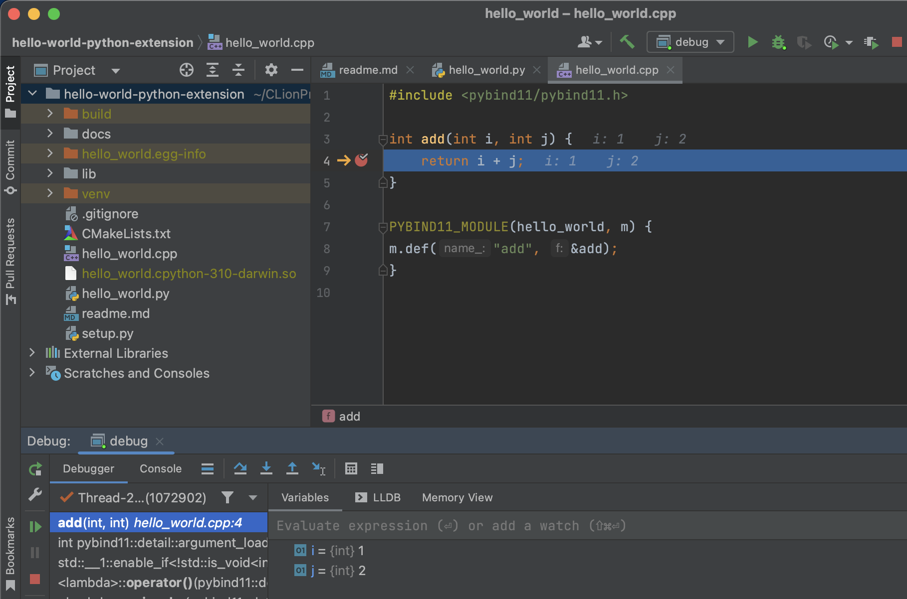

this micro project is about get-it-going 'python extension in the debugger' - clion and pybind11 are used - critical links to begin further explorations are - 

- https://www.jetbrains.com/help/clion/debugging-python-extensions.html 
- https://pybind11.readthedocs.io/en/stable/compiling.html#building-with-cmake 

